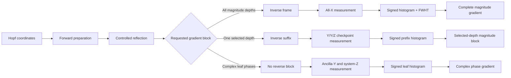

# Hopf-QBP: implementation reference and exact-logical validation

Reference circuits, decoders, compiler analyses, statistical extensions, and
deterministic tests for *Compass in the Mirror: Quantum Backpropagation with
the Hopf Ansatz*.

This repository has two public roles:

1. **For reviewers:** show exactly which manuscript claims are supported, where
   they are implemented, and what the tests do and do not establish.
2. **For quantum engineers:** provide the conventions, circuit interfaces,
   decoders, resource models, and extension rules needed to reproduce or adapt
   the Hopf gradient constructions without reconstructing them from the paper.

This is an executable reference implementation, not a production SDK and not a
hardware benchmark.

## What problem does Hopf-QBP solve?

The first Hopf construction made selected coordinate derivatives executable,
but the measured index made each execution informative about one selected
coordinate. Hopf-QBP addresses the finite-shot cost of returning the complete
**raw Hopf-coordinate gradient**. Under calibrated controlled-reflection access,
every global magnitude outcome contributes to every magnitude coordinate; a
separate leaf record supplies the complex phase derivatives.

For a complete chart with `M = N - 1` real coordinates or `M = 2*N - 1`
complex coordinates, where `N = 2**n`, the resource layers are distinct:

| Quantity | Global Hopf-QBP scaling |
|---|---|
| Returned object | Materialized `M`-entry raw coordinate-gradient vector |
| Independent executions | `O((1 + log(n/delta))/epsilon^2)` |
| Fixed-accuracy execution count | `O(log log M)` |
| Controlled-reflection calls | One per independent execution |
| Direct-angle Hopf work per magnitude execution | `O(M log M)` |
| Direct-angle total Hopf work at fixed accuracy/confidence | `O(M log M log log M)` |
| One optimized state-equivalent recompilation | `O(M)` Hopf work per execution |
| Optimized total Hopf work at fixed accuracy/confidence | `O(M log log M)` |
| Walsh decoding | `O(M log M)` |
| Materialized output | `M` classical entries |

Thus `O(log log M)` counts independent circuit executions, not end-to-end
runtime or output size. The result is output-sensitive because `M = Theta(2**n)`.
Reflection-sum objectives introduce their coefficient-one-norm scale; see
[Observables and readout](docs/OBSERVABLES_AND_READOUT.md).

## Choose a route

| Goal | Start here |
|---|---|
| Audit a paper-level claim | [Claim support and validation map](docs/CLAIM_SUPPORT.md) |
| Understand the output objects, norm hierarchy, and metric boundary | [Statistical accuracy](docs/STATISTICAL_ACCURACY.md) |
| Compare gradient methods under their actual tasks and access models | [Method comparison](docs/METHOD_COMPARISON.md) |
| Understand or implement the defining direct-angle Hopf compiler | [Engineering guide](docs/ENGINEERING_GUIDE.md) |
| Study exact ideal-model invariance under optimized recompilation | [Optimized compilation companion](docs/OPTIMIZED_COMPILATION.md) |
| Extend to reflection sums or inspect readout sensitivity | [Observables and readout](docs/OBSERVABLES_AND_READOUT.md) |
| Reproduce the deterministic validation | [Reproducibility checklist](REPRODUCIBILITY.md) |
| Read the first paper and its implementation | [Hopf-ansatz repository](https://github.com/GoGoKo699/Hopf-ansatz) |

## Scope relative to the first Hopf paper

The two repositories are complementary. The first paper provides the chart and
its indexed geometric gradient interface; this project addresses the
statistical output bottleneck of a complete gradient.

| Inherited from the first paper | Introduced and validated here |
|---|---|
| Universal balanced real and complex Hopf charts | Computationally addressed orthogonal differential frame |
| Explicit inverse map and diagonal pullback metric | One all-`X` record shared by every magnitude coordinate and depth |
| Normalized coordinate tangents and exact tangent-state preparation | Signed histogram and Walsh decoding of the complete magnitude block |
| Indexed signed-branch estimator for a selected derivative | Direct one-hot record for all complex leaf-phase derivatives |
| Layer- and phase-indexed compiled access families | Complete-gradient finite-shot concentration analysis |
| Native real and complex preparation schedules | Reverse-local checkpoint adjoints and active-interface contracts |

The distinctive step is not Hadamard interference or the Walsh transform in
isolation. It is their integration with the addressed Hopf frame so that one
physical outcome contributes to every magnitude coordinate.

## Direct-angle Hopf compiler contract

The Hopf ansatz is not treated here as only an abstract coordinate-to-state map
followed by an arbitrary state-preparation compiler. Its defining circuit
realization preserves

```math
\text{one Hopf coordinate}
\longleftrightarrow
\text{one designated tree-split or leaf-phase location}
\longleftrightarrow
\text{one directly programmed physical angle}.
```

For magnitude coordinates this is the `R_y` angle attached to an internal tree
node. In the complex chart, each leaf-phase coordinate is retained as a directly
programmed phase angle. The native preparations, depth-ordered completion
`U_chk`, addressed frame `W_R`, and checkpoint suffixes retain this direct-angle
structure. The manuscript's finite resource ledger belongs to this
coordinate-preserving setting.

A state-equivalent compiler may multiplex several rotations and replace the
elementary angles by compiler-generated combinations. Such a compiler can
preserve the state, frame action, and decoded estimator without preserving the
one-coordinate-one-angle interpretation. The optimized companion therefore
tests **exact ideal-model invariance and asymptotic compiler robustness**, not
noise resilience and not a redefinition of the ansatz.

“Quantum backpropagation” is used in this state-coordinate and matched-resource
sense. The repository does not claim a generic reverse-mode differentiator for
an arbitrary layered parameterized circuit.

## Supported access model

The core objective is

```math
E_O(\boldsymbol{\theta})
=
\langle\psi(\boldsymbol{\theta})|O|\psi(\boldsymbol{\theta})\rangle.
```

The validated gradient protocols assume:

- `O` is a known Hermitian unitary, so `O = O†` and `O² = I`;
- exact controlled access to `O` is available; and
- the relative phase between the controlled branches is known or calibrated.

An unknown controlled-branch phase rotates the measured interference components
and invalidates the fixed decoder. A real-coefficient reflection sum can be
handled by coefficient-one-norm term sampling, with the resulting `Lambda**2`
sampling factor documented in
[Observables and readout](docs/OBSERVABLES_AND_READOUT.md). Generic nonunitary
observables, approximate block encodings, routing, approximate synthesis, and
hardware noise remain outside the validated core contract.

## What is implemented

For a balanced Hopf chart on `n` system qubits, with `N = 2**n`, the repository
implements and validates:

- real and complex Hopf forward preparations;
- the balanced real differential frame `W_R`;
- the phase-dressed complex magnitude frame `W_C = D_ph W_R`;
- one global measurement stream for all real magnitude coordinates;
- one global magnitude stream plus one direct leaf-phase stream for the complex chart;
- checkpointed reverse gradients at any selected tree depth;
- signed-histogram, Walsh, phase one-hot, and checkpoint decoders;
- full-unitary, initialized-state-column, active-interface, and clean-flag contracts;
- singular-coordinate behavior;
- the manuscript's direct-angle assigned Hopf CNOT ledger;
- an Appendix-B clean-flag factorization for one `O(N)` multiplexed recompilation;
- complete-vector `l_2`, relative/directional, and natural-gradient-conditioning analyses;
- exact raw-coordinate versus normalized-frame separation;
- ambient-sphere and projective phase-metric conventions;
- common-phase objective-invariance projection;
- reflection-sum term sampling; and
- exact independent-readout-error transfer functions.

The four-qubit helpers are validation fixtures, not the organizing principle of
the implementation.

## Architecture



## Three output records

### Global magnitude record

For internal node `j`, one all-`X` outcome `(b, y)` contributes

```math
Z_j
=
2\sqrt{g_{j,j}}\,(-1)^{b+\lambda(j)\cdot y}.
```

The same physical outcome contributes to every magnitude coordinate. A signed
system histogram followed by one fast Walsh-Hadamard transform evaluates all
required parities together.

### Direct complex phase record

One ancilla-`Y` and system-`Z` outcome `(b, ell)` contributes

```math
Z^{\mathrm{ph}}
=
2(-1)^b e_{\ell}.
```

It updates one leaf bin and directly estimates the complete phase-gradient
block.

### Checkpoint record

At selected depth `d`, one outcome `(b_c, b_t, r)` contributes

```math
Z_d^{\mathrm{chk}}
=
-2(-1)^{b_c+b_t}e_r.
```

It updates one prefix bin and estimates every magnitude derivative at that
depth.

The exact sign, bit order, and gate-angle conventions are specified in the
[engineering guide](docs/ENGINEERING_GUIDE.md).

## Which method should an engineer use?

| Need | Recommended method | Reason |
|---|---|---|
| All or many magnitude depths | Global frame | One circuit family and one record stream serve every depth. |
| One depth or a small set of depths | Checkpoint | Reverse only the suffix below each requested depth. |
| Complex phase derivatives | Direct phase stream | Phase tangents are already leaf-local; no inverse frame is needed. |
| General portable complex implementation | Separated real/phase blocks | This is the designated general construction. |
| Preserve direct coordinate-to-angle control | Direct-angle Hopf compiler | This is the defining geometric circuit setting. |
| Reproduce the manuscript's finite CNOT table | Direct-angle assigned ledger | It uses the declared coordinate-preserving decomposition. |
| Test exact state-equivalent resynthesis | Multiplexed companion | It preserves the logical action while generally recombining elementary angles. |
| Four-qubit compiler regression | Integrated four-qubit fixtures | Tests complete-frame and active-interface identities. |

At a fixed depth, the global and checkpoint records are unbiased and have
Euclidean norm `2`. Their practical difference is cross-depth reuse versus
reverse-circuit locality.

## Quick start

Use Python 3.10, 3.11, 3.12, or 3.13.

```bash
python -m venv .venv
source .venv/bin/activate
python -m pip install --upgrade pip
python -m pip install -r requirements.txt
python -m pip install -r requirements-optional.txt
```

Run the Qibo-free analytic checks:

```bash
python validate_qbp.py --analytic
```

Run representative circuit contracts:

```bash
python validate_qbp.py --smoke
```

Run the complete deterministic suite:

```bash
python validate_qbp.py
```

Print the two resource ledgers:

```bash
python qbp_resource_ledger.py --nmin 2 --nmax 10
python qbp_optimized_resource_ledger.py --nmin 2 --nmax 10
```

Regenerate the validation figures:

```bash
python make_validation_figures.py
```

See [REPRODUCIBILITY.md](REPRODUCIBILITY.md) for clean-environment commands,
expected coverage, output formats, determinism, and tolerances.

## Validation coverage

The implementation separates circuit construction from analytic references:

- `qbp_validation/circuits.py` builds and executes Qibo circuits;
- `qbp_validation/reference.py` computes independent NumPy states, frames,
  derivatives, gradients, and interface matrices;
- `qbp_validation/decoders.py` converts complete output distributions into
  gradient records;
- `qbp_validation/optimized_compiler.py` checks the exact clean-flag
  factorization and multiplexor-core ledger;
- `qbp_validation/supporting_analysis.py` implements complete-vector,
  directional, geometric-boundary, phase-metric, reflection-sum, and readout
  consequences; and
- `qbp_validation/tests/` compares all supported contracts.

General circuit checks cover `n = 1, 2, 3, 4`. Qibo-independent native
state-column checks extend through `n = 5`. The clean-flag depth factorization
is checked through `n = 5`, and the complete flagged frame through `n = 4`.
Deterministic cases include interior coordinates, final-layer signs, exact
singular angles, zero-amplitude leaves, Pauli and diagonal reflections, and
fixed-seed Householder reflections.

The central circuit suite uses exact statevectors and complete output
probability distributions. It does not use Monte Carlo shots.

<p align="center">
  
</p>

<p align="center">
  
</p>

These plots summarize finite-dimensional identity checks. They are not
performance, scaling, or hardware data.

## What the validation establishes

The suite directly checks finite-dimensional algebraic and exact-logical
statements: prepared state columns, frame matrices, gradient means, decoder
signs, active-interface identities, singular-coordinate behavior, assigned
resource formulas, clean-flag factorization, coordinate/frame separation, phase
metric conventions, and supporting statistical/readout identities.

It does **not** numerically prove concentration inequalities or asymptotic
complexity statements. Those conclusions combine checked finite premises with
mathematical concentration and synthesis results. The claim-by-claim boundary
is recorded in [docs/CLAIM_SUPPORT.md](docs/CLAIM_SUPPORT.md).

## Logical substitution contracts and compiler scope

The implementation distinguishes:

1. **Full-unitary equality:** `U = V`.
2. **Initialized-state-column equality:** `U|0...0> = V|0...0>`.
3. **Active-interface equality:** `U P_d = V P_d` on a checkpoint subspace.
4. **Clean-flag equality:** the system action equals `W_R` when the flag enters
   and leaves in `|0>`.

These logical identities do not automatically preserve the direct-angle
coordinate-to-control contract. Estimator correctness and inheritance of the
manuscript's resource model are reported separately.

## Resource hierarchy

### Direct-angle assigned ledger: manuscript setting

`qbp_resource_ledger.py` reproduces the manuscript's finite assigned Hopf CNOT
charges. It retains every magnitude coordinate as its designated tree-split
angle and every complex leaf phase as a directly programmed phase angle. It is
a concrete coordinate-preserving ledger, not a claim of global CNOT optimality.

### Multiplexed companion: exact ideal-model invariance

`qbp_optimized_resource_ledger.py` groups each depth into a uniformly controlled
rotation. The forward multiplexor cores use at most `N - 2` CNOTs. The addressed
real frame uses one reusable clean suffix flag and at most `3*N/2 - 2` CNOTs for
its multiplexor cores, plus polynomial suffix-predicate work. Thus

```math
C(U_{\mathrm{chk}})=O(N),
\qquad
C(W_{\mathbb R})=O(N).
```

The separated complex construction is also `O(N)`. This is an exact
state-equivalent compiler result in the ideal circuit model. It does not imply
noise robustness, routed-device performance, or preservation of elementary
Hopf angles. See [Optimized compilation](docs/OPTIMIZED_COMPILATION.md).

Both ledgers separate the controlled observable, measurement, readout,
application-specific workspace, routing, approximate synthesis, and any
separately assigned phase-layer charge.

## Repository map

| Path | Role |
|---|---|
| `validate_qbp.py` | Analytic, smoke, and complete validation entry point. |
| `make_validation_figures.py` | Recomputes validation figures from circuit and analytic data. |
| `qbp_resource_ledger.py` | Direct-angle assigned CNOT ledger. |
| `qbp_optimized_resource_ledger.py` | Multiplexed exact-compilation companion. |
| `qbp_validation/conventions.py` | Tree indices, bit order, markers, interfaces, and assigned formulas. |
| `qbp_validation/native_schedule.py` | Native real and complex schedules. |
| `qbp_validation/reference.py` | Independent states, frames, derivatives, gradients, and matrices. |
| `qbp_validation/circuits.py` | Qibo builders for forward, global, phase, checkpoint, and compiler tests. |
| `qbp_validation/decoders.py` | Walsh and signed-histogram decoders. |
| `qbp_validation/optimized_compiler.py` | Clean-flag factorization and core counts. |
| `qbp_validation/supporting_analysis.py` | Statistical, geometric, phase-metric, reflection-sum, and readout formulas. |
| `qbp_validation/tests/` | Claim-level exact-logical and analytic tests. |
| `docs/CLAIM_SUPPORT.md` | Claim-to-code and claim-to-test map. |
| `docs/ENGINEERING_GUIDE.md` | Direct-angle compiler and implementation guide. |
| `docs/OPTIMIZED_COMPILATION.md` | Optimized state-equivalent compilation analysis. |
| `docs/STATISTICAL_ACCURACY.md` | Output norms, metric conditioning, and phase conventions. |
| `docs/METHOD_COMPARISON.md` | Neutral comparison by returned object and access model. |
| `docs/OBSERVABLES_AND_READOUT.md` | Reflection-sum and readout extensions. |
| `REPRODUCIBILITY.md` | Environment, commands, outputs, and tolerances. |

## Scope boundaries

This repository does not claim to provide optimizer benchmarks, execution-time
benchmarks, a generic controlled-observable compiler, hardware routing, a full
noise study, approximate synthesis, physical-device performance, or a
general-purpose automatic-differentiation framework.

The validated central object is the raw Hopf state-coordinate gradient under
the stated controlled-reflection access model. Converting raw-coordinate error
to normalized-frame or natural-gradient error requires the metric conditions
made explicit in [Statistical accuracy](docs/STATISTICAL_ACCURACY.md).

## Papers in the series

- **Second paper:** *Compass in the Mirror: Quantum Backpropagation with the Hopf Ansatz*.
- **First paper:** [A Compass on the Quantum State Sphere: The Hopf Ansatz for Arbitrary Pure-State Optimization](https://arxiv.org/abs/2607.14231).
- **First-paper code:** [GoGoKo699/Hopf-ansatz](https://github.com/GoGoKo699/Hopf-ansatz).

The repositories have no runtime dependency on one another.

## Citation

When using this repository, cite both the Hopf-QBP manuscript and the first
Hopf-ansatz paper. Machine-readable software metadata is provided in
`CITATION.cff`.

## License

This software is released under the [MIT License](LICENSE).
