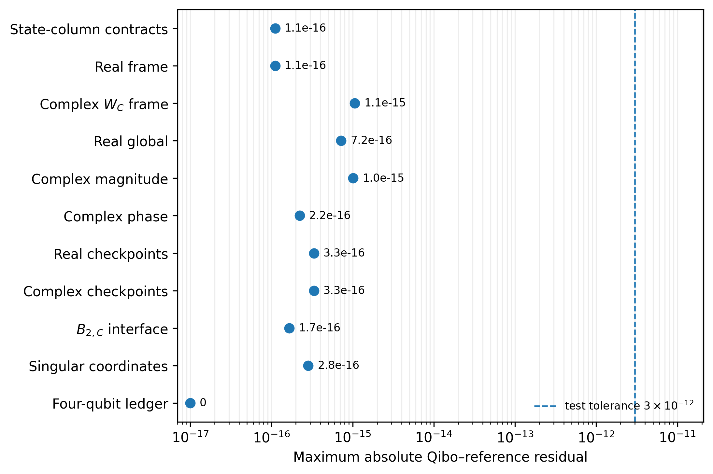
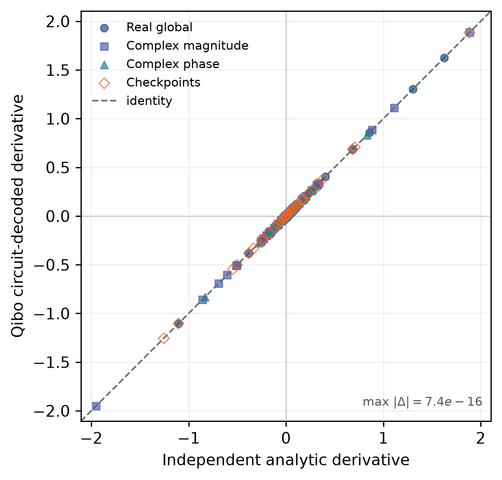

# Hopf-QBP Exact-Logical Validation

Deterministic exact-logical validation for the constructions in
*The Compass in Reverse: Quantum Backpropagation with the Hopf Ansatz*.

This repository checks the Hopf-specific statements used by the manuscript:

- the balanced real-Hopf differential frame $W_{\mathbb R}$;
- the complex magnitude frame $W_{\mathbb C}=D_{\mathrm{ph}}W_{\mathbb R}$;
- the complete real and complex global-magnitude estimators;
- the direct complex leaf-phase estimator;
- checkpointed Hopf adjoints at every depth;
- state-column, full-frame, and checkpoint-interface contracts;
- singular-coordinate behavior;
- the complete four-qubit construction, including the addressed $R_C$ compiler
  of $W_{\mathbb C}$ and the depth-$2$ suffix $B_{2,\mathbb C}$; and
- the manuscript's compiler-relative assigned CNOT ledger.

The analytic reference formulas and decoders do not import Qibo or call circuit
builders. Circuit tests build and execute actual `qibo.models.Circuit` objects
with Qibo's NumPy statevector backend. Complete output distributions are summed
exactly; no Monte Carlo shots are used.

## Papers in the series

- **Accompanying manuscript:** *The Compass in Reverse: Quantum Backpropagation with the Hopf Ansatz*
- **First paper:** [A Compass on the Quantum State Sphere: The Hopf Ansatz for Arbitrary Pure-State Optimization](https://arxiv.org/abs/2607.14231)
- **First-paper code:** [GoGoKo699/Hopf-ansatz](https://github.com/GoGoKo699/Hopf-ansatz)

The repositories are complementary and have no runtime dependency on one
another. `Hopf-ansatz` contains the optimization chart, geometry, stress tests,
and safeguards accompanying the first paper. `Hopf-QBP` contains exact-logical
validation of the global-frame, direct-phase, and checkpointed reverse
constructions in the second manuscript.

## Scope

The repository validates finite-dimensional algebraic and exact-logical circuit
identities. It does **not** benchmark:

- optimizer performance;
- finite-shot convergence;
- execution time or memory;
- device routing;
- approximate synthesis;
- hardware noise; or
- physical-device performance.

Assigned CNOT charges are computed from the compiler model stated in the
manuscript. They are not Qibo-transpiler counts. The controlled observable,
readout, workspace, and any separately assigned diagonal phase-layer charge are
excluded wherever the corresponding manuscript ledger excludes them.

## Repository structure

| File or directory | Role |
|---|---|
| [`validate_qbp.py`](validate_qbp.py) | Runs the analytic checks, a representative smoke suite, or the complete circuit suite. |
| [`make_validation_figures.py`](make_validation_figures.py) | Recomputes the two deterministic validation figures from circuit and analytic data. |
| [`qbp_resource_ledger.py`](qbp_resource_ledger.py) | Prints the general Hopf ledger and the complete four-qubit manuscript detail. |
| [`qbp_validation/conventions.py`](qbp_validation/conventions.py) | Tree indexing, basis order, marker labels, wire translation, interface projectors, and resource formulas. |
| [`qbp_validation/native_schedule.py`](qbp_validation/native_schedule.py) | Reproduces the first paper's native `HopfReal` and `HopfComplex` schedules and charges without Qibo. |
| [`qbp_validation/reference.py`](qbp_validation/reference.py) | Independent recursive states, frames, derivatives, gradients, $W_{\mathbb C}$, and four-qubit interface matrices. |
| [`qbp_validation/circuits.py`](qbp_validation/circuits.py) | Qibo builders for native preparations, $U_{\mathrm{chk}}$, $W_{\mathbb R}$, $W_{\mathbb C}$, global estimators, checkpoints, and the two integrated four-qubit blocks. |
| [`qbp_validation/decoders.py`](qbp_validation/decoders.py) | Walsh, signed-histogram, phase one-hot, and checkpoint decoders. |
| [`qbp_validation/cases.py`](qbp_validation/cases.py) | Deterministic interior, singular, and observable cases. |
| [`qbp_validation/tests/`](qbp_validation/tests/) | Convention, circuit, operator-contract, decoder, singular-case, four-qubit, native-schedule, and resource tests. |
| [`REPRODUCIBILITY.md`](REPRODUCIBILITY.md) | Clean-environment commands, suite descriptions, figure regeneration, and deterministic-output notes. |

## Installation

Use Python 3.10, 3.11, 3.12, or 3.13.

```bash
python -m venv .venv
source .venv/bin/activate
python -m pip install --upgrade pip
python -m pip install -r requirements.txt
python -m pip install -r requirements-optional.txt
```

The analytic suite requires only `requirements.txt`. The smoke suite, complete
circuit suite, and validation-figure regeneration also require the pinned Qibo
dependency in `requirements-optional.txt`.

## Quick start

Run the Qibo-free convention, decoder, native-schedule, and resource checks:

```bash
python validate_qbp.py --analytic
```

Run those checks plus representative Qibo tests of the three operator contracts:

```bash
python validate_qbp.py --smoke
```

Run the complete validation suite:

```bash
python validate_qbp.py
```

Regenerate the committed validation figures:

```bash
python make_validation_figures.py
```

Print the assigned logical CNOT ledger:

```bash
python qbp_resource_ledger.py --nmin 2 --nmax 10
```

Machine-readable output is available through:

```bash
python qbp_resource_ledger.py --nmin 2 --nmax 10 --format csv
python qbp_resource_ledger.py --nmin 2 --nmax 10 --format json
```

## Notation and operator contracts

For `n` system qubits, let $N=2^n$. Python arrays use zero-based indexing,
while manuscript parameters use one-based indexing.

- `theta_mag[j - 1]` stores $\theta_j$ for $1\leq j\leq N-1$.
- `theta_ph[ell]` stores $\theta_{N+\ell}$ for $0\leq\ell<N$.
- Basis states are written $\lvert q_n\cdots q_1\rangle$.
- Qibo system index `0` is the most-significant basis bit and corresponds to
  manuscript wire $q_n$; Qibo index `n - 1` corresponds to $q_1$.
- The papers use $R_y(\theta)=e^{-i\theta Y}$, so Qibo receives `RY(2 * theta)`.

The current manuscript separates three contracts:

$$
U=V
\quad\text{(full-unitary equality)},
$$

$$
U\lvert0\rangle^{\otimes n}=V\lvert0\rangle^{\otimes n}
\quad\text{(prepared-state-column equality)},
$$

$$
UP_d=VP_d
\quad\text{(checkpoint-interface equality)}.
$$

The real native, depth, and frame completions share a prepared state:

$$
\mathrm{HopfReal}\lvert0\rangle^{\otimes n}
=U_{\mathrm{chk}}\lvert0\rangle^{\otimes n}
=W_{\mathbb R}\lvert0\rangle^{\otimes n},
$$

but they are generally different full unitaries. The complex frame is

$$
W_{\mathbb C}:=D_{\mathrm{ph}}W_{\mathbb R},
\qquad
W_{\mathbb C}^{\dagger}=W_{\mathbb R}^{\dagger}D_{\mathrm{ph}}^{\dagger}.
$$

The four-qubit addressed $R_C$ compiler implements this complete frame up to one
common phase. The four-qubit complex checkpoint suffix satisfies

$$
B_{2,\mathbb C}P_2=D_{\mathrm{ph}}B_2P_2,
$$

but is generally not equal to $D_{\mathrm{ph}}B_2$ as a full unitary.
Consequently, an integrated checkpoint implementation preserves the required
signed one-hot gradient means but need not preserve the complete output
distribution of the separated implementation.

## Circuit implementations validated

The repository validates both implementations used in the manuscript.

### Designated separated implementation

The complex global circuit is

$$
U_{\mathrm{chk}}
\;\longrightarrow\;
D_{\mathrm{ph}}
\;\longrightarrow\;
\mathrm{ctrl}(O)
\;\longrightarrow\;
D_{\mathrm{ph}}^{\dagger}
\;\longrightarrow\;
W_{\mathbb{R}}^{\dagger}.
$$

### Integrated four-qubit implementation

- **Global magnitude:** native `HopfComplex` forward preparation followed, after
  the controlled observable, by the addressed $W_{\mathbb{C}}^{\dagger}$
  decoder.
- **Depth-2 checkpoint:** native `HopfComplex` forward preparation followed,
  after the controlled observable, by the integrated
  $B_{2,\mathbb{C}}^{\dagger}$ decoder. This is compared with the separated
  reverse sequence $D_{\mathrm{ph}}^{\dagger}$ followed by $B_2^{\dagger}$.

The global implementations produce the same complete output distribution. For
the depth-2 checkpoint, the separated and integrated implementations preserve
the same decoded gradient mean, although their complete output distributions
need not be identical.

## What counts as circuit-level validation

A circuit check satisfies both conditions:

1. the tested state or complete measurement distribution is produced by an
   actual `qibo.models.Circuit` executed with the NumPy statevector backend; and
2. the expected state, frame, derivative, gradient, or interface matrix is
   computed by [`qbp_validation/reference.py`](qbp_validation/reference.py),
   which imports no Qibo code and calls no circuit builder.

The suite does not inject expected statevectors into Qibo. Controlled
`RY(2 * theta)` and addressed $R_C$ gates use explicit open controls. Exact
diagonal phase layers and controlled reflections are represented by logical
`Unitary` gates, matching the manuscript's exact-logical access model.

## Validation matrix

| Test group | Statement checked |
|---|---|
| [`test_conventions.py`](qbp_validation/tests/test_conventions.py) | Big-endian labels, marker bijection, wire translation, parameter splitting, interface projectors, and observable assumptions. |
| [`test_native_schedule.py`](qbp_validation/tests/test_native_schedule.py) | Native real/complex schedules, state columns through $n=5$, and native charges. |
| [`test_circuit_conventions.py`](qbp_validation/tests/test_circuit_conventions.py) | Qibo bit significance and the manuscript's $S^\dagger$-then-$H$ ancilla-$Y$ sign convention. |
| [`test_operator_contracts.py`](qbp_validation/tests/test_operator_contracts.py) | Prepared-column equality, full-unitary inequality, the $B_{2,\mathbb C}$ interface identity, and gradient-mean versus distribution equivalence. |
| [`test_real_frame.py`](qbp_validation/tests/test_real_frame.py) | Complete $W_{\mathbb R}$ matrices, inverses, and singular completion columns. |
| [`test_complex_frame.py`](qbp_validation/tests/test_complex_frame.py) | Separated $W_{\mathbb C}$ and the complete addressed $R_C$ compiler up to its common phase. |
| [`test_real_global_estimator.py`](qbp_validation/tests/test_real_global_estimator.py) | Complete real gradients, direct/FWHT agreement, and native-forward distribution equality. |
| [`test_complex_magnitude.py`](qbp_validation/tests/test_complex_magnitude.py) | Separated and integrated complex-magnitude global circuits. |
| [`test_complex_phase.py`](qbp_validation/tests/test_complex_phase.py) | Signed one-hot phase records, common-phase cancellation, native-forward equality, and zero-amplitude leaves. |
| [`test_checkpoints.py`](qbp_validation/tests/test_checkpoints.py) | Real and separated complex checkpoints at every depth, native real forwards, and integrated complex depth $2$. |
| [`test_singular_cases.py`](qbp_validation/tests/test_singular_cases.py) | Zero metric factors and zero-amplitude phase coordinates. |
| [`test_decoders.py`](qbp_validation/tests/test_decoders.py) | FWHT correctness, signed histograms, suffix marginalization, and fixed-norm records. |
| [`test_four_qubit_example.py`](qbp_validation/tests/test_four_qubit_example.py) | Appendix marker labels, node $5$, all checkpoint depths, the eight $B_{2,\mathbb C}$ sectors, and addressed $R_C$ phase arguments. |
| [`test_resource_ledger.py`](qbp_validation/tests/test_resource_ledger.py) | Controlled-gate, native, depth, frame, suffix, and record-circuit assigned charges. |

## Validation figures

<p align="center">
  
</p>

Each point is the largest absolute discrepancy in one deterministic validation
family. The dashed line is the principal unit-test tolerance
$3\times10^{-12}$. Residuals at floating-point roundoff scale are finite-size
identity checks, not performance data.

<p align="center">
  
</p>

Each plotted point is a gradient component obtained by exact summation of a
complete circuit output distribution. A deterministic subset is displayed for
legibility; the annotated maximum residual is computed over all checked
components.

## Coverage and interpretation

Balanced Hopf circuit checks use $n=1,2,3,4$ and include:

- generic interior coordinates;
- real final-layer sign changes;
- upstream angles equal to $0$ and $\pi/2$;
- zero-amplitude complex leaves;
- Pauli reflections;
- diagonal reflections; and
- fixed-seed Householder reflections.

Qibo-independent native real and complex state-column checks run through $n=5$.
The integrated $W_{\mathbb C}$ and $B_{2,\mathbb C}$ checks are explicitly
four-qubit, matching Appendix A of the manuscript. The tests do not numerically
prove concentration inequalities or asymptotic resource statements. Decoder
complexity is not timed and workspace is not measured.

## Citation

When using this repository, cite both:

1. *The Compass in Reverse: Quantum Backpropagation with the Hopf Ansatz*; and
2. the first Hopf-ansatz paper, [arXiv:2607.14231](https://arxiv.org/abs/2607.14231).
