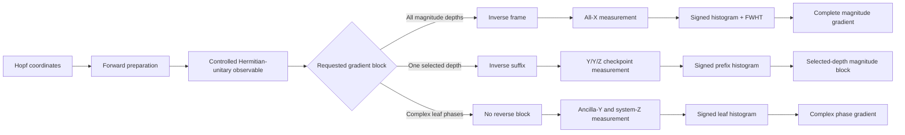

# Hopf-QBP: implementation reference and exact-logical validation

Reference circuits, decoders, compiler analyses, statistical extensions, and
deterministic tests for *Compass in the Mirror: Quantum Backpropagation with
the Hopf Ansatz*.

This repository has two public roles:

1. **For reviewers:** show exactly which manuscript claims are supported, where
   they are implemented, and what the tests do and do not establish.
2. **For quantum engineers:** provide the conventions, circuit interfaces,
   decoders, resource models, and extension rules needed to reproduce or adapt
   the Hopf gradient constructions without reconstructing them from the paper.

This is an executable reference implementation, not a production SDK and not a
hardware benchmark.

## Choose a route

| Goal | Start here |
|---|---|
| Audit a paper-level claim | [Claim support and validation map](docs/CLAIM_SUPPORT.md) |
| Understand or implement the defining direct-angle Hopf compiler | [Engineering guide](docs/ENGINEERING_GUIDE.md) |
| Study robustness under optimized state-equivalent recompilation | [Optimized compilation companion](docs/OPTIMIZED_COMPILATION.md) |
| Interpret `l_infinity`, `l_2`, directional, or gauge accuracy | [Statistical accuracy](docs/STATISTICAL_ACCURACY.md) |
| Extend to reflection sums or inspect readout sensitivity | [Observables and readout](docs/OBSERVABLES_AND_READOUT.md) |
| Reproduce the deterministic validation | [Reproducibility checklist](REPRODUCIBILITY.md) |
| Read the first paper and its implementation | [Hopf-ansatz repository](https://github.com/GoGoKo699/Hopf-ansatz) |

## Scope relative to the first Hopf paper

The two repositories are complementary. The first paper provides the chart and
its geometric gradient interface; this repository addresses the statistical
output bottleneck of a complete gradient.

| Inherited from the first paper | Introduced and validated here |
|---|---|
| Universal balanced real and complex Hopf charts | Computationally addressed orthogonal differential frame |
| Explicit inverse map and diagonal pullback metric | One all-`X` record shared by every magnitude coordinate and depth |
| Normalized coordinate tangents and exact tangent-state preparation | Signed histogram and Walsh decoding of the complete magnitude block |
| Indexed signed-branch estimator for a selected derivative | Direct one-hot record for all complex leaf-phase derivatives |
| Layer- and phase-indexed compiled access families | Complete-gradient finite-shot concentration analysis |
| Native real and complex preparation schedules | Reverse-local checkpoint adjoints and active-interface contracts |

## Direct-angle Hopf compiler contract

The Hopf ansatz is not treated here as only an abstract map from coordinates to
states followed by an arbitrary state-preparation compiler. Its defining
circuit realization preserves the correspondence

```math
\theta_j
\longleftrightarrow
\text{tree node }j
\longleftrightarrow
\text{one programmable physical rotation angle}.
```

The native preparations, the depth-ordered completion `U_chk`, the addressed
frame `W_R`, and the checkpoint suffixes all retain this direct-angle tree
structure. That correspondence keeps the inverse coordinates, diagonal metric,
tangent directions, and physical controls transparent in the same notation.
The manuscript's finite resource ledger belongs to this coordinate-preserving
setting.

A state-equivalent compiler may multiplex several Hopf rotations and replace
the elementary physical angles by compiler-generated combinations. Such a
compiler can preserve the prepared state, the frame action, and the decoded QBP
estimator without preserving the one-coordinate-one-angle interpretation. The
optimized compiler material in this repository is therefore a **robustness
analysis beyond the defining direct-angle setting**, not a redefinition of the
Hopf ansatz.

“Quantum backpropagation” is used in this state-coordinate and matched-resource
sense. The repository does not claim a generic reverse-mode differentiator for
an arbitrary layered parameterized circuit.

## What is implemented

For a balanced Hopf chart on `n` system qubits, with `N = 2**n`, the repository
implements and validates:

- real and complex Hopf forward preparations;
- the balanced real differential frame `W_R`;
- the phase-dressed complex magnitude frame `W_C = D_ph W_R`;
- one global measurement stream for all real magnitude coordinates;
- one global magnitude stream plus one direct leaf-phase stream for the complex chart;
- checkpointed reverse gradients at any selected tree depth;
- signed-histogram, Walsh, phase one-hot, and checkpoint decoders;
- full-unitary, initialized-state-column, and active-interface contracts;
- singular-coordinate behavior;
- the manuscript's direct-angle assigned Hopf CNOT ledger;
- a repository-only clean-flag robustness factorization for an `O(N)` multiplexed recompilation;
- complete-vector `l_2`, conditional direction, and common-phase analyses;
- reflection-sum term sampling; and
- exact independent-readout-error transfer functions.

The four-qubit helpers are validation fixtures. They are not the organizing
principle of the repository and are not required to understand the general
implementation.

## Supported access model

The core objective is

```math
E_O(\boldsymbol{\theta})
=
\langle\psi(\boldsymbol{\theta})|O|\psi(\boldsymbol{\theta})\rangle.
```

The validated gradient protocols assume:

- `O` is a known Hermitian unitary, so `O = O†` and `O² = I`;
- exact controlled access to `O` is available; and
- the relative phase between the controlled branches is known or calibrated.

An unknown controlled-branch phase rotates the measured interference
quadrature and invalidates the decoded sign. A reflection-sum extension is
provided in [Observables and readout](docs/OBSERVABLES_AND_READOUT.md), but
generic nonunitary observables, approximate block encodings, routing,
approximate synthesis, and hardware noise remain outside the validated core
contract.

## Architecture



## Three output records

### Global magnitude record

For internal node `j`, one all-`X` outcome `(b, y)` contributes

```math
Z_j
=
2\sqrt{g_{j,j}}\,(-1)^{b+\lambda(j)\cdot y}.
```

The same physical outcome contributes to every magnitude coordinate. A signed
system histogram followed by one fast Walsh-Hadamard transform evaluates all
required parities together.

### Direct complex phase record

One ancilla-`Y` and system-`Z` outcome `(b, ell)` contributes

```math
Z^{\mathrm{ph}}
=
2(-1)^b e_{\ell}.
```

It updates one leaf bin and directly estimates the complete phase-gradient
block.

### Checkpoint record

At selected depth `d`, one outcome `(b_c, b_t, r)` contributes

```math
Z_d^{\mathrm{chk}}
=
-2(-1)^{b_c+b_t}e_r.
```

It updates one prefix bin and estimates every magnitude derivative at that
depth.

The exact sign, bit-order, and gate-angle conventions are specified in the
[engineering guide](docs/ENGINEERING_GUIDE.md).

## Which method should an engineer use?

| Need | Recommended method | Reason |
|---|---|---|
| All or many magnitude depths | Global frame | One circuit family and one record stream serve every depth. |
| One depth or a small set of depths | Checkpoint | Reverse only the suffix below each requested depth. |
| Complex phase derivatives | Direct phase stream | Phase tangents are already leaf-local; no inverse frame is needed. |
| General, portable complex implementation | Separated real/phase blocks | This is the designated general construction. |
| Preserve one coordinate as one physical rotation angle | Direct-angle Hopf compiler | This is the defining geometric circuit setting of the two papers. |
| Reproduce the manuscript's finite CNOT table | Direct-angle assigned ledger | It decomposes the coordinate-preserving controlled rotations under the declared formulas. |
| Test asymptotic robustness after state-equivalent resynthesis | Multiplexed robustness companion | It preserves the logical action while generally recombining elementary physical angles. |
| Four-qubit compiler regression | Integrated four-qubit fixtures | Tests complete-frame and active-interface identities. |

At a fixed depth, the global and checkpoint records are both unbiased and have
Euclidean norm `2`. Their practical difference is cross-depth reuse versus
reverse-circuit locality.

## Quick start

Use Python 3.10, 3.11, 3.12, or 3.13.

```bash
python -m venv .venv
source .venv/bin/activate
python -m pip install --upgrade pip
python -m pip install -r requirements.txt
python -m pip install -r requirements-optional.txt
```

Run the Qibo-free analytic checks:

```bash
python validate_qbp.py --analytic
```

Run the analytic checks plus representative circuit contracts:

```bash
python validate_qbp.py --smoke
```

Run the complete deterministic validation suite:

```bash
python validate_qbp.py
```

Print the direct-angle assigned ledger and the optimized robustness companion:

```bash
python qbp_resource_ledger.py --nmin 2 --nmax 10
python qbp_optimized_resource_ledger.py --nmin 2 --nmax 10
```

Regenerate the committed validation figures:

```bash
python make_validation_figures.py
```

See [REPRODUCIBILITY.md](REPRODUCIBILITY.md) for clean-environment commands,
expected coverage, output formats, determinism, and tolerance details.

## Validation coverage

The implementation separates circuit construction from analytic reference
formulas:

- `qbp_validation/circuits.py` builds and executes Qibo circuits;
- `qbp_validation/reference.py` computes independent NumPy states, frames,
  derivatives, gradients, and interface matrices;
- `qbp_validation/decoders.py` converts complete output distributions into
  gradient records;
- `qbp_validation/optimized_compiler.py` checks the clean-flag robustness
  factorization and multiplexor-core ledger;
- `qbp_validation/supporting_analysis.py` implements statistical, reflection,
  gauge, and readout consequences; and
- `qbp_validation/tests/` compares all supported contracts.

General circuit checks cover `n = 1, 2, 3, 4`. Qibo-independent native
state-column checks extend through `n = 5`. The optimized clean-flag depth
factorization is checked through `n = 5`, and the complete flagged frame through
`n = 4`. Deterministic cases include:

- generic interior coordinates;
- final-layer real sign changes;
- upstream angles equal to `0` and `pi/2`;
- zero-amplitude complex leaves;
- Pauli reflections;
- diagonal reflections; and
- fixed-seed Householder reflections.

The central circuit suite uses exact statevectors and complete output
distributions. It does not use Monte Carlo shots.

<p align="center">
  
</p>

<p align="center">
  
</p>

These plots summarize finite-dimensional identity checks. They are not
performance, scaling, or hardware data.

## What the validation establishes

The suite directly checks finite-dimensional algebraic and exact-logical
statements: prepared state columns, frame matrices, gradient means, decoder
signs, active-interface identities, singular-coordinate behavior, assigned
resource formulas, the clean-flag robustness factorization, and supporting
statistical/readout identities.

It does **not** numerically prove concentration inequalities or asymptotic
complexity statements. The statistical scaling follows from fixed-norm record
properties. The optimized robustness conclusion combines an exact checked
factorization with established uniformly controlled-rotation and
multi-controlled-X synthesis bounds. The claim-by-claim boundary is recorded in
[docs/CLAIM_SUPPORT.md](docs/CLAIM_SUPPORT.md).

## Logical substitution contracts and compiler scope

Several circuit substitutions are valid only under a specific logical
contract:

1. **Full-unitary equality:** `U = V`.
2. **Initialized-state-column equality:** `U|0...0> = V|0...0>`.
3. **Active-interface equality:** `U P_d = V P_d` on a specified checkpoint
   subspace.
4. **Clean-flag equality:** the system action equals `W_R` when the reusable
   flag enters and leaves in `|0>`.

The native Hopf preparation, depth completion, and addressed frame share the
required initialized state column but are generally different full unitaries.
The four-qubit integrated checkpoint compiler is validated on its active
interface and need not preserve the complete output distribution of the
separated implementation.

These logical equalities do not by themselves preserve the direct-angle Hopf
compiler contract. A state- or frame-equivalent resynthesis may change the
relationship between coordinates and elementary physical gate angles. Engineers
should therefore distinguish correctness of the decoded estimator from
inheritance of the manuscript's coordinate-preserving resource model.

## Resource hierarchy

### Direct-angle assigned ledger: manuscript setting

`qbp_resource_ledger.py` reproduces the manuscript's finite assigned Hopf CNOT
charges. It retains each Hopf coordinate as the physical angle of its designated
tree rotation and decomposes those controlled rotations independently under the
declared no-clean-ancilla formulas. It is a concrete coordinate-preserving
ledger, not a claim of global CNOT optimality.

### Multiplexed robustness companion: repository-only analysis

`qbp_optimized_resource_ledger.py` groups each depth into a uniformly controlled
rotation. The forward preparation has a CNOT upper bound `N - 2` for its
multiplexor cores. The addressed real frame uses one reusable clean suffix flag
and has a multiplexor-core bound `3*N/2 - 2` for `n >= 2`, plus a separately
reported polynomial suffix-predicate overhead. Thus

```math
C(U_{\mathrm{chk}})=O(N),
\qquad
C(W_{\mathbb R})=O(N).
```

The diagonal phase layer is also exactly synthesizable in `O(N)`, so the same
scaling holds for the separated complex construction. This establishes
asymptotic robustness outside the direct-angle compiler; it does not preserve
one coordinate as one elementary physical rotation angle and does not redefine
the ansatz. See [Optimized compilation](docs/OPTIMIZED_COMPILATION.md) for the
derivation, clean-flag contract, references, and test map.

Both analyses separate:

- the controlled observable;
- measurement and readout;
- application-specific workspace;
- device routing;
- approximate synthesis; and
- any separately assigned phase-layer charge where stated.

## Repository map

| Path | Role |
|---|---|
| `validate_qbp.py` | Analytic, smoke, and complete validation entry point. |
| `make_validation_figures.py` | Recomputes validation figures from circuit and analytic data. |
| `qbp_resource_ledger.py` | Direct-angle assigned CNOT ledger used by the manuscript. |
| `qbp_optimized_resource_ledger.py` | Multiplexed robustness companion outside the defining compiler setting. |
| `qbp_validation/conventions.py` | Tree indices, bit order, marker labels, interface projectors, and assigned formulas. |
| `qbp_validation/native_schedule.py` | Native `HopfReal` and `HopfComplex` schedules inherited from the first paper. |
| `qbp_validation/reference.py` | Independent states, frames, derivatives, gradients, and compiler matrices. |
| `qbp_validation/circuits.py` | Qibo builders for forward, global, phase, checkpoint, and compiler-test circuits. |
| `qbp_validation/decoders.py` | Walsh and signed-histogram decoders. |
| `qbp_validation/optimized_compiler.py` | Clean-flag robustness factorization and multiplexor-core counts. |
| `qbp_validation/supporting_analysis.py` | `l_2`, direction, gauge, reflection-sum, and readout formulas. |
| `qbp_validation/cases.py` | Deterministic parameter and observable cases. |
| `qbp_validation/tests/` | Claim-level exact-logical and analytic tests. |
| `docs/CLAIM_SUPPORT.md` | Reviewer-oriented claim-to-code and claim-to-test map. |
| `docs/ENGINEERING_GUIDE.md` | Direct-angle compiler contract and self-contained implementation guide. |
| `docs/OPTIMIZED_COMPILATION.md` | Robustness analysis under optimized state-equivalent recompilation. |
| `docs/STATISTICAL_ACCURACY.md` | Complete-vector, direction, metric, and gauge consequences. |
| `docs/OBSERVABLES_AND_READOUT.md` | Reflection-sum and analytic readout extensions. |
| `REPRODUCIBILITY.md` | Environment, commands, deterministic outputs, and tolerances. |

## Scope boundaries

This repository does not claim to provide:

- optimizer benchmarks;
- execution-time or memory benchmarks;
- a generic controlled-observable compiler;
- hardware routing or a full noise study;
- approximate synthesis;
- physical-device performance; or
- a general-purpose automatic-differentiation framework.

The finite-shot formulas are analytic consequences of the record structure;
they are not presented as hardware data. The validated central object is the
Hopf state-coordinate gradient interface under the stated access model. The
multiplexed analysis asks whether that object remains asymptotically viable
after leaving its defining direct-angle compiler; it does not change the scope
of the two papers.

## Papers in the series

- **Second paper:** *Compass in the Mirror: Quantum Backpropagation with the Hopf Ansatz*.
- **First paper:** [A Compass on the Quantum State Sphere: The Hopf Ansatz for Arbitrary Pure-State Optimization](https://arxiv.org/abs/2607.14231).
- **First-paper code:** [GoGoKo699/Hopf-ansatz](https://github.com/GoGoKo699/Hopf-ansatz).

The repositories have no runtime dependency on one another.

## Citation

When using this repository, cite both the Hopf-QBP manuscript and the first
Hopf-ansatz paper. Machine-readable software metadata is provided in
`CITATION.cff`.

## License

This software is released under the [MIT License](LICENSE).
