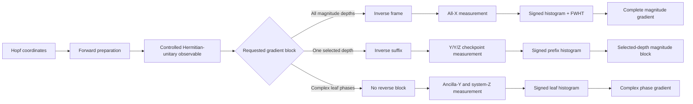

# Hopf-QBP: implementation reference and exact-logical validation

Reference circuits, decoders, resource formulas, and deterministic tests for
*Compass in the Mirror: Quantum Backpropagation with the Hopf Ansatz*.

This repository has two public roles:

1. **For reviewers:** show exactly which manuscript claims are supported, where
   they are implemented, and what the tests do and do not establish.
2. **For quantum engineers:** provide the conventions, circuit interfaces,
   decoders, resource model, and extension rules needed to reproduce or adapt
   the Hopf gradient constructions without reconstructing them from the paper.

This is an executable reference implementation, not a production SDK and not a
hardware benchmark.

## Choose a route

| Goal | Start here |
|---|---|
| Check whether the code supports a paper claim | [Claim support and validation map](docs/CLAIM_SUPPORT.md) |
| Implement or adapt a gradient circuit | [Engineering guide](docs/ENGINEERING_GUIDE.md) |
| Reproduce the deterministic validation | [Reproducibility checklist](REPRODUCIBILITY.md) |
| Inspect the code structure | [Repository map](#repository-map) |
| Read the first paper and its implementation | [Hopf-ansatz repository](https://github.com/GoGoKo699/Hopf-ansatz) |

## What is implemented

For a balanced Hopf chart on `n` system qubits, with `N = 2**n`, the repository
implements and validates:

- real and complex Hopf forward preparations;
- the balanced real differential frame `W_R`;
- the phase-dressed complex magnitude frame `W_C = D_ph W_R`;
- one global measurement stream for all real magnitude coordinates;
- one global magnitude stream plus one direct leaf-phase stream for the complex chart;
- checkpointed reverse gradients at any selected tree depth;
- signed-histogram, Walsh, phase one-hot, and checkpoint decoders;
- full-unitary, initialized-state-column, and active-interface contracts;
- singular-coordinate behavior;
- compiler-relative assigned Hopf CNOT formulas; and
- explicit four-qubit compiler fixtures used to test integrated constructions.

The four-qubit helpers are validation fixtures. They are not the organizing
principle of the repository and are not required to understand the general
implementation.

## Supported access model

The objective is

```math
E_O(\boldsymbol{\theta})
=
\langle\psi(\boldsymbol{\theta})|O|\psi(\boldsymbol{\theta})\rangle.
```

The implemented gradient protocols assume:

- `O` is a known Hermitian unitary, so `O = O†` and `O² = I`;
- exact controlled access to `O` is available; and
- the relative phase between the controlled branches is known or calibrated.

An unknown controlled-branch phase rotates the measured interference
quadrature and invalidates the decoded sign. General nonunitary observables,
approximate block encodings, routing, synthesis, and hardware noise are outside
this repository's validated contract.

## Architecture



The three output records are deliberately simple:

### Global magnitude record

For internal node `j`, one all-`X` outcome `(b, y)` contributes

```math
Z_j
=
2\sqrt{g_{j,j}}\,(-1)^{b+\lambda(j)\cdot y}.
```

The same outcome contributes to every magnitude coordinate. A signed system
histogram followed by one fast Walsh-Hadamard transform evaluates all required
parities together.

### Direct complex phase record

One ancilla-`Y` and system-`Z` outcome `(b, ell)` contributes

```math
Z^{\mathrm{ph}}
=
2(-1)^b e_{\ell}.
```

It updates one leaf bin and directly estimates the complete phase-gradient
block.

### Checkpoint record

At selected depth `d`, one outcome `(b_c, b_t, r)` contributes

```math
Z_d^{\mathrm{chk}}
=
-2(-1)^{b_c+b_t}e_r.
```

It updates one prefix bin and estimates every magnitude derivative at that
depth.

The exact sign, bit-order, and gate-angle conventions are specified in the
[engineering guide](docs/ENGINEERING_GUIDE.md).

## Which method should an engineer use?

| Need | Recommended method | Reason |
|---|---|---|
| All or many magnitude depths | Global frame | One circuit family and one record stream serve every depth. |
| One depth or a small set of depths | Checkpoint | Reverse only the suffix below each requested depth. |
| Complex phase derivatives | Direct phase stream | Phase tangents are already leaf-local; no inverse frame is needed. |
| General, portable implementation | Separated real/phase blocks | This is the designated implementation and resource model. |
| Four-qubit compiler regression | Integrated four-qubit fixtures | These test complete-frame and active-interface compiler identities. |

At a fixed depth, the global and checkpoint records are both unbiased and have
Euclidean norm `2`. Their practical difference is cross-depth reuse versus
reverse-circuit locality.

## Quick start

Use Python 3.10, 3.11, 3.12, or 3.13.

```bash
python -m venv .venv
source .venv/bin/activate
python -m pip install --upgrade pip
python -m pip install -r requirements.txt
python -m pip install -r requirements-optional.txt
```

Run the Qibo-free analytic checks:

```bash
python validate_qbp.py --analytic
```

Run the analytic checks plus representative circuit contracts:

```bash
python validate_qbp.py --smoke
```

Run the complete deterministic validation suite:

```bash
python validate_qbp.py
```

Print the assigned Hopf CNOT ledger:

```bash
python qbp_resource_ledger.py --nmin 2 --nmax 10
```

Regenerate the committed validation figures:

```bash
python make_validation_figures.py
```

See [REPRODUCIBILITY.md](REPRODUCIBILITY.md) for clean-environment commands,
expected test coverage, output formats, determinism, and tolerance details.

## Validation coverage

The implementation separates circuit construction from analytic reference
formulas:

- `qbp_validation/circuits.py` builds and executes Qibo circuits;
- `qbp_validation/reference.py` computes independent NumPy states, frames,
  derivatives, gradients, and interface matrices;
- `qbp_validation/decoders.py` converts complete output distributions into
  gradient records; and
- `qbp_validation/tests/` compares the two sides.

General circuit checks cover `n = 1, 2, 3, 4`. Qibo-independent native
state-column checks extend through `n = 5`. Deterministic cases include:

- generic interior coordinates;
- final-layer real sign changes;
- upstream angles equal to `0` and `pi/2`;
- zero-amplitude complex leaves;
- Pauli reflections;
- diagonal reflections; and
- fixed-seed Householder reflections.

The suite uses exact statevectors and complete output distributions. It does
not use Monte Carlo shots.

<p align="center">
  
</p>

<p align="center">
  
</p>

These plots summarize finite-dimensional identity checks. They are not
performance, scaling, or hardware data.

## What the validation establishes

The suite directly checks finite-dimensional algebraic and exact-logical
statements: prepared state columns, frame matrices, gradient means, decoder
signs, active-interface identities, singular-coordinate behavior, and assigned
resource formulas.

It does **not** numerically prove concentration inequalities or asymptotic
complexity statements. The statistical scaling follows from the fixed-norm
record property, while the resource scaling follows from the declared gate
ledger. The repository exposes and tests the ingredients so those deductions
remain inspectable. The exact claim-by-claim boundary is recorded in
[docs/CLAIM_SUPPORT.md](docs/CLAIM_SUPPORT.md).

## Three circuit contracts

Several circuit substitutions are valid only under a specific contract:

1. **Full-unitary equality:** `U = V`.
2. **Initialized-state-column equality:** `U|0...0> = V|0...0>`.
3. **Active-interface equality:** `U P_d = V P_d` on a specified checkpoint
   subspace.

The native Hopf preparation, depth completion, and addressed frame share the
required initialized state column but are generally different full unitaries.
The four-qubit integrated checkpoint compiler is validated on its active
interface and need not preserve the complete output distribution of the
separated implementation.

Engineers should not promote a state-column or active-interface identity to a
full-unitary identity. See [Engineering guide: substitution contracts](docs/ENGINEERING_GUIDE.md#8-substitution-contracts).

## Resource model

The ledger reports **assigned Hopf CNOT charges** under the compiler model used
by the manuscript. These are not Qibo transpiler counts.

The following are separated from the Hopf ledger unless explicitly stated:

- the controlled observable;
- measurement and readout;
- application-specific workspace;
- device routing;
- approximate synthesis; and
- any separately assigned diagonal phase-layer charge.

The ledger is implemented in `qbp_validation/conventions.py` and exposed by
`qbp_resource_ledger.py`. Its formulas and limitations are summarized in the
[engineering guide](docs/ENGINEERING_GUIDE.md#12-assigned-resource-ledger).

## Repository map

| Path | Role |
|---|---|
| `validate_qbp.py` | Analytic, smoke, and complete validation entry point. |
| `make_validation_figures.py` | Recomputes validation figures from circuit and analytic data. |
| `qbp_resource_ledger.py` | Prints text, CSV, or JSON assigned-resource tables. |
| `qbp_validation/conventions.py` | Tree indices, bit order, marker labels, interface projectors, and resource formulas. |
| `qbp_validation/native_schedule.py` | Native `HopfReal` and `HopfComplex` schedules inherited from the first paper. |
| `qbp_validation/reference.py` | Independent states, frames, derivatives, gradients, and compiler matrices. |
| `qbp_validation/circuits.py` | Qibo builders for forward, global, phase, checkpoint, and compiler-test circuits. |
| `qbp_validation/decoders.py` | Walsh and signed-histogram decoders. |
| `qbp_validation/cases.py` | Deterministic parameter and observable cases. |
| `qbp_validation/tests/` | Claim-level exact-logical tests. |
| `docs/CLAIM_SUPPORT.md` | Reviewer-oriented claim-to-code and claim-to-test map. |
| `docs/ENGINEERING_GUIDE.md` | Self-contained implementation and adaptation guide. |
| `REPRODUCIBILITY.md` | Environment, commands, deterministic outputs, and tolerances. |

## Scope boundaries

This repository does not claim to provide:

- optimizer benchmarks;
- finite-shot convergence experiments;
- execution-time or memory benchmarks;
- a generic controlled-observable compiler;
- hardware routing or noise studies;
- approximate synthesis;
- physical-device performance; or
- a general-purpose automatic-differentiation framework.

Those are separate engineering or application layers. The validated object here
is the Hopf state-coordinate gradient interface under the stated access model.

## Papers in the series

- **Second paper:** *Compass in the Mirror: Quantum Backpropagation with the Hopf Ansatz*.
- **First paper:** [A Compass on the Quantum State Sphere: The Hopf Ansatz for Arbitrary Pure-State Optimization](https://arxiv.org/abs/2607.14231).
- **First-paper code:** [GoGoKo699/Hopf-ansatz](https://github.com/GoGoKo699/Hopf-ansatz).

The repositories are complementary and have no runtime dependency on one
another. The first repository provides the coordinate chart, inverse map,
optimizer geometry, stress tests, and native preparation schedules. This
repository provides the reverse gradient constructions and their exact-logical
validation.

## Citation

When using this repository, cite both the Hopf-QBP manuscript and the first
Hopf-ansatz paper. Machine-readable software metadata is provided in
`CITATION.cff`.
